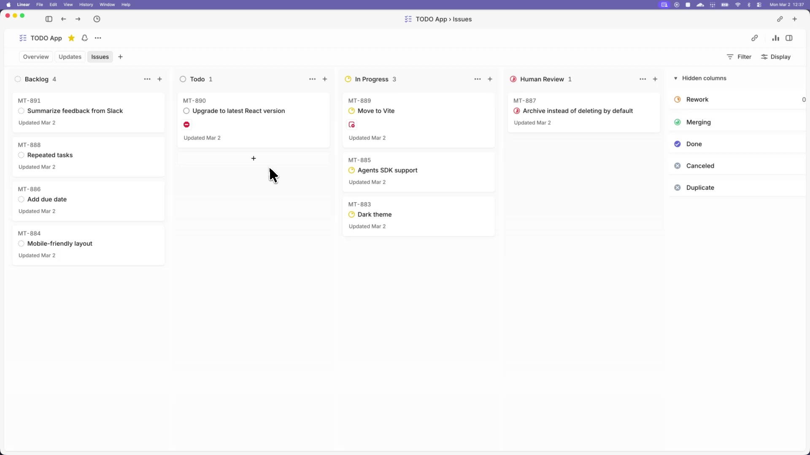

# Symphony Claude Code

Fork of [openai/symphony](https://github.com/openai/symphony) with **Claude Code CLI** support as an alternative agent backend.

Symphony turns project work into isolated, autonomous implementation runs, allowing teams to manage
work instead of supervising coding agents. This fork adds the ability to use
[Anthropic's Claude Code](https://docs.anthropic.com/en/docs/claude-code) alongside the original
OpenAI Codex backend, selectable via a simple config switch.

## What's Different

- **Claude Code Adapter** (`ClaudeCode.Adapter`) — implements the same `start_session/run_turn/stop_session` interface as `Codex.AppServer`
- **Provider routing** — `AgentRunner` selects between Codex and Claude Code based on `agent.kind` in `WORKFLOW.md`
- **Claude Code config schema** — new `claude_code` section for CLI command, model, permissions, and timeouts
- **Zero changes to existing modules** — orchestrator, dashboard, web API, and all Codex code remain untouched

```yaml
# Switch agent backend in WORKFLOW.md:
agent:
  kind: claude_code    # "codex" (default) or "claude_code"

claude_code:
  command: claude
  model: sonnet
  permission_mode: bypassPermissions
  turn_timeout_ms: 600000
```

[](https://player.vimeo.com/video/1186371009?h=5626e4b899)

_In this [demo video](https://player.vimeo.com/video/1186371009?h=5626e4b899), Symphony monitors a Linear board for work and spawns agents to handle the tasks. The agents complete the tasks and provide proof of work: CI status, PR review feedback, complexity analysis, and walkthrough videos. When accepted, the agents land the PR safely. Engineers do not need to supervise Codex; they can manage the work at a higher level._

> [!WARNING]
> Symphony is a low-key engineering preview for testing in trusted environments.

## Running Symphony

### Requirements

Symphony works best in codebases that have adopted
[harness engineering](https://openai.com/index/harness-engineering/). Symphony is the next step --
moving from managing coding agents to managing work that needs to get done.

### Option 1. Make your own

Tell your favorite coding agent to build Symphony in a programming language of your choice:

> Implement Symphony according to the following spec:
> https://github.com/openai/symphony/blob/main/SPEC.md

### Option 2. Use this Claude Code fork

Check out [elixir/README.md](elixir/README.md) for instructions on how to set up your environment
and run the Elixir-based Symphony implementation with Claude Code support:

> Set up Symphony Claude Code for my repository based on
> https://github.com/ismyu/symphony-claude-code/blob/main/elixir/README.md

> Set up Symphony for my repository based on
> https://github.com/openai/symphony/blob/main/elixir/README.md

---

## License

This project is licensed under the [Apache License 2.0](LICENSE).
